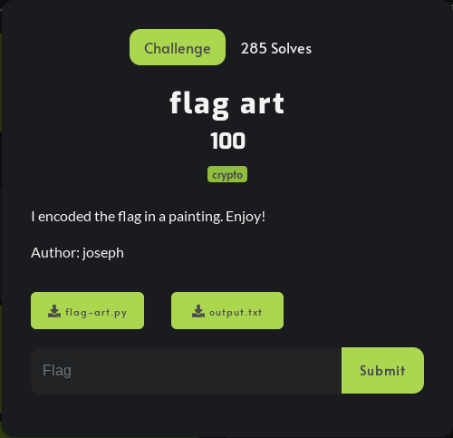

# Investigation/Code Review

[https://github.com/DownUnderCTF/Challenges_2023_Public/tree/main/beginner/flag-art/publish](https://github.com/DownUnderCTF/Challenges_2023_Public/tree/main/beginner/flag-art/publish)

Generally, when looking at Crypto ctfs, you will be given 2 things: a program that “encrypts” the flag and the output (which is the encrypted flag). This is what this challenge looked like!



.py is the encryption program and output.txt is the encrypted flag.

The idea is that the encryption program has a flaw in it and can be reversed or exploited. This is what we call bad encryption and finding the vulnerability is the hard part. To do this we must see what the output looks like and understand how the encryption program works.

Using any type of text editor or IDE to open the text file and Python program. I am using Neovim to open and edit the files.

### output.txt

```Python
                                                			==                      
                                          wo=.=*.w.        ^==-                     
                                     ^..ow==w*.w=o=        .w^.                                 
                                .--==w*.w=o=...=.=         *.w.^==                              
                             .-.wwo=.=*.w.^.wwo==.-=.=     *..--.=-*=                           
                           ....w.^==-^.wwo.w=o.wo*=...==.-.wwo=.o=.wo                           
                         *==w*..--..--=w=-.w.^==-^=w=-=.-^.wwo..o..wo*                          
                    =w=-.wwo==oo==w*==.-=www.wwo.wo*==w*==.-.wwo=.w=..-                         
            *..-*.wwo.=-o=.oo==.-.wwo==.-      =.=*        .wwo.wo*=w=-..                       
          ow=w=-.wwo==w*..ow=w=-.wwo                       ==.-=.=*==oo=w=-.                    
          wwo..ow==w*.w.^.=.w=.=*==o                       o.wwo=wo.=.=*..ow.=                  
          .w==.-.wwo.w=o=.=*.wwo==oo                       ==w*=www=w=-.wwo.w=o.w               
          o*=w=-.wwo==oo=w=-==.-==.-                       ==w*==-^=w=-.wwo..--=.               
          =*.w.^==-^.wwo=w=-.w.^=.=*      =.w^      ==-^   .wo*.==o.wwo=wo^=.=*=.               
            w^..ow.wwo..wo..--==w*==-^.wwo=...==.-.=-w.w   wo.w-^==.===wo..o..=..               
              =.-o..ow=.=w=.o=..-*.w.^==.-.w=o..ow=.w^=.   o=.w=o==o...-*.w.^=w.                
              o..-*..wo=w.o..wo..--.=w-==-^=w.o..wo..ow.   .-*==oo=w.o..wo..--.                 
              =w-==-^=w.o.=w-..ow==.        *=w.o.w-.===   w=w.o..--..-*..-*=                   
               www=.w^.=w.=w.o.w=              o.=w-.w-...--=.=w=w.o..-*..ow                    
                 =w.o=                             .o=.wo*==o..w.^=.=w==.                       
                                                      -=.=w=w.o..ow=.=w==                       
                                                        oo.=w-==o..w.^.=                        
                                                           .w=.   =w.                           
                                                                                                
                                                                .ow==o..w                       
                                                                .^==-^=.-                       
                                                                  .=w.*
```

### flag-art.py

```Python
message = open('./message.txt', 'rb').read() + open('./flag.txt', 'rb').read()

palette = '.=w-o^*'
template = list(open('./mask.txt', 'r').read())

canvas = ''
for c in message:
    for m in [2, 3, 5, 7]:
        while True:
            t = template.pop(0)
            if t == 'X':
                canvas += palette[c % m]
                break
            else:
                canvas += t

print(canvas)


```

  

The output.txt file shows us what the encrypted flag looks like but it doesn't tell us what is important, the important information about the output will come from understanding the code. When understanding code you need to comprehend exactly what is going on. So usually you would just trace the code in your head when you are good with python, but for now, I wrote pseudocode to help.

```Python
""" This is pseudocode!!!!!!
message = text from both messege.txt file and flag.txt file

palette = characters used to encode output.txt '.=w-o^*'
template = mask used to create the austrailian flag format for output.txt

canvas(aka output.txt) = nothing at first
for each character in message:
	for each number in this set [2,3,5,7]
		loop untill break command
			t = pull first character from template which should be a X or space value
			if t equals 'X':
				add to canvas(output.txt) a value from palette depending on the result of {[c % m]= [(ascii value of character from message) Modulo (value from [2,3,5,7])}
				break
			else:
				add to canvas(output.txt) a space character

print(canvas(aka output.txt))
"""
```

What is going on in the code can be summarized: Each ASCII value for each character in the flag is modulod by the values [2,3,5,7]. Each result will determine which character from the palette(.=w-o^*) is added to the output.txt.  
Now, given the pseudocode, I like to make a pseudo input to the output of the code to understand how we can find a vulnerability in this code. To do this we must first understand the output of the mod operator(%). The mod operator simply returns the remainder of the first value divided by the second value. This means that different first values divided by the same second values can return the same result which makes mod(%) not directly reversible. Ex. 5 mod 2 = 1 and 7 mod 2 = 1. If I make an equation like x mod 2 = 1 solve for x……There are an infinite amount of values that make this true. So if I do 27 mod 2 = 1 and only give you the result 1 and tell you I modded with 2, can you find what value I modded? No, you can not. Given this information here is the input-output setup I created.  

```Python
""" pseudo input to output                                         
c1 mod 2 => 0,1           => ., =
c1 mod 3 => 0,1,2         => ., =, w
c1 mod 5 => 0,1,2,3,4,    => ., =, w, -, o
c1 mod 7 => 0,1,2,3,4,5,6 => ., =, w, -, o, ^, *
                 .  
c2 mod 2         .
c2 mod 3         .
c2 mod 5         .
c2 mod 7         .
    .
    .
    .
    .
 """
```

If this input-output code were to continue to iterate between every character in the flag.txt then it would create the output.txt with every 4 characters from the output.txt representing 1 character in the flag.txt. What about the spaces in the output.txt then? Looking at the if-else statement, you can see that the space added to output.txt is only added when there is a space in the mask, which has nothing to do with the actual “encryption” part. So you have two options: to write the solution to deal with all the spaces when they come along, or to change the output.txt to have no spaces and just read each line in groups of 4. The second option is much simpler.

To change the output.txt to have no spaces or newlines, use this website: “[https://www.browserling.com/tools/remove-all-whitespace](https://www.browserling.com/tools/remove-all-whitespace)” or use this command inside of nvim “:%s/\n\|\s//g”.

# Finding the solution

```Python
"""
., =, w, -, o, ^, *
0, 1, 2, 3, 4, 5, 6
"""
```

Based on the input-to-output pseudo code written above, we will have a set of symbols that correlate to the value 0-6 which can be “reverse modulesed” to represent 1 decimal version of an ASCII variable per every 4 chunks of output. If we can reverse just 1 character then we can reverse all of them. Something to note instantly is that ASCII characters only go up to 127 in decimal([https://www.asciitable.com/](https://www.asciitable.com/)). So what I said earlier about modulus and having an infinite amount of possibilities that solve the equation x mod 2 = 1 is no longer true. In this instance, we only have 127 values to check which would be very quick for a computer. But even this would still give us many results, we need only 1 solution. But, Again, based on the pseudo-code, each 4 symbols represents 1 character. So the values that satisfied the first equation x mod 2 = ? must also satisfy x mod 3 = ?, x mod 5 = ?, and x mod 7 = ?.

We can begin to see that all we must do is brute force each decimal value from 0-127 and check if it satisfies each modulus equation for every 4 chunks of symbols. This idea works as long as multiple values don’t satisfy all 4 modulus equations. You can try and create a program to solve it from here and it would work. But the actual explanation of why this works and doesn't have any values that have the same outputs is due to something called the Chinese Remainder theorem([https://en.wikipedia.org/wiki/Chinese_remainder_theorem](https://en.wikipedia.org/wiki/Chinese_remainder_theorem)).

Here Is the solution I came up with based on the idea we made above:

```Python
def find_number_for_conditions(first_digit, second_digit, third_digit, last_digit):
    num = 0
    max_num = 127  # Maximum allowed ASCII value
    max_iterations = max_num + 1  # Limit the number of iterations
    while num <= max_num and max_iterations > 0:
        if (
            num % 2 == first_digit and
            num % 3 == second_digit and
            num % 5 == third_digit and
            num % 7 == last_digit
        ):
            return num
        num += 1
        max_iterations -= 1
 
symbol_mapping = {'.': 0, '=': 1, 'w': 2, '-': 3, 'o': 4, '^': 5, '*': 6}

input_symbols = "==wo=.=*.w.^==-^..ow==w*.w=o=.w^..--==w*.w=o=...=.=*.w.^==.-.wwo=.=*.w.^.wwo==.-=.=*..--.=-*=....w.^==-^.wwo.w=o.wo*=...==.-.wwo=.o=.wo*==w*..--..--=w=-.w.^==-^=
w=-=.-^.wwo..o..wo*=w=-.wwo==oo==w*==.-=www.wwo.wo*==w*==.-.wwo=.w=..-*..-*.wwo.=-o=.oo==.-.wwo==.-=.=*.wwo.wo*=w=-..ow=w=-.wwo==w*..ow=w=-.wwo==.-=.=*==oo=w=-.wwo..ow==w*.w.^.=.
w=.=*==oo.wwo=wo.=.=*..ow.=.w==.-.wwo.w=o=.=*.wwo==oo==w*=www=w=-.wwo.w=o.wo*=w=-.wwo==oo=w=-==.-==.-==w*==-^=w=-.wwo..--=.=*.w.^==-^.wwo=w=-.w.^=.=*=.w^==-^.wo*.==o.wwo=wo^=.=*=
.w^..ow.wwo..wo..--==w*==-^.wwo=...==.-.=-w.wwo.w-^==.===wo..o..=..=.-o..ow=.=w=.o=..-*.w.^==.-.w=o..ow=.w^=.o=.w=o==o...-*.w.^=w.o..-*..wo=w.o..wo..--.=w-==-^=w.o..wo..ow..-*==o
o=w.o..wo..--.=w-==-^=w.o.=w-..ow==.*=w.o.w-.===w=w.o..--..-*..-*=www=.w^.=w.=w.o.w=o.=w-.w-...--=.=w=w.o..-*..ow=w.o=.o=.wo*==o..w.^=.=w==.-=.=w=w.o..ow=.=w==oo.=w-==o..w.^.=.w=
.=w..ow==o..w.^==-^=.-.=w.*"

input_values = [symbol_mapping[symbol] for symbol in input_symbols]

output_values = []

# Iterate through the input values in chunks of 4
for i in range(0, len(input_values), 4):
    chunk = input_values[i:i+4]
    
    if len(chunk) == 4:
        first_digit, second_digit, third_digit, last_digit = chunk
        result = find_number_for_conditions(first_digit, second_digit, third_digit, last_digit)
        output_values.append(result)

print("List of output values:", output_values)

english_text = ''.join([chr(val) for val in output_values])
print("English text:", english_text)
```

## Flag

After running the code above you get this result:

```Python
"""
Congratulations on solving this challenge! The mask has 900 X's so here are some random words to make the message long enough. 
Your flag is: DUCTF{r3c0nstruct10n_0f_fl4g_fr0m_fl4g_4r7_by_l00kup_t4bl3_0r_ch1n3s3_r3m41nd3r1ng?}
"""
```